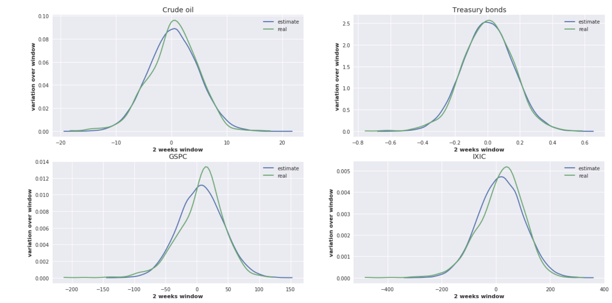

# Stocks Risk Analysis using Monte Carlo Simulation

In this notebook, we focus on using Monte Carlo Simulation and Multiple Linear Regression to analysis financial risk on stocks portfolio.

<figure>
  
  <figcaption>Simulate the Market Factors</figcaption>
</figure>

The idea is to find "similar" users, so that the system can suggest new artists according to these similarities. In other words: if user "A" likes artist "X", a similar user "B" could like "X" too.

Notebook can be divided into two parts:

 * Given the artists and the user behaviours datasets, the first step is to analyze them and clean the data (for example: several artist names could refer to the same person or band, we need to find and uniformize those alias), here we use the **SparkSQL** to manipulate those data.

 * After that we build a **"preference matrix"** which gives for each user-item pair, a value that represents what is known about the degree of preference of that user for that item. The value of row i, column j expresses how much does user i like item j. 

 Then we choose the **collaborative-filtering** approach to build our recommender system, which in other word is to fill our "preference matrix". We use Parallel Altenating Least Squares**(ALS)** in Spark-MLLib to implement the above algorithm.

